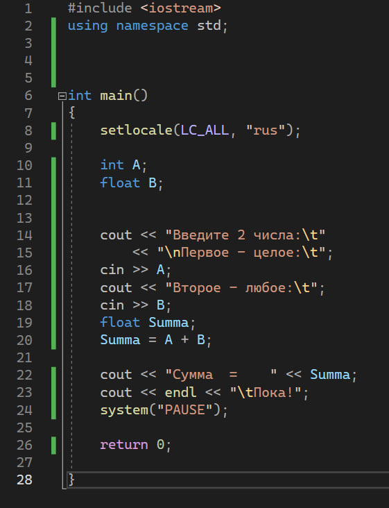
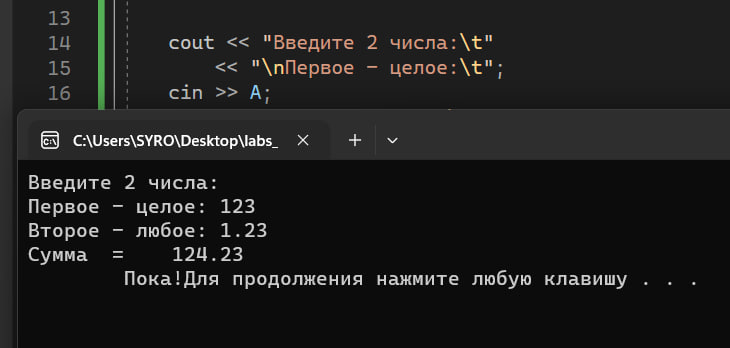

# Отчет к лабораторной работе №1
## Тема:
```
«Основные средства и технология разработки консольных программных проектов в интегрированной среде Visual Studio .NET»
```
## Часть 1 (Написание и запуск кода проекта)
### _Задание_:
```
1)Изучить основные средства и технологию разработки консольных программных проектов в интегрированной среде Visual Studio .NET.
2)Выполнить все шаги по созданию первого консольного проекта на VC++
```
При выполнении заданий (переписать код) изучил основные средства и технологию разработки консольных программных проектов в интегрированной среде "Visual Studio .NET".  
  


После написания кода, была произведена его компиляция. Ниже представлен пример работы программы:  


## Часть 2 (Исходный код проекта и блок-схема)
Исходный код программы можно посмотреть [====>ТУТ<====](https://pastebin.com/raw/Vbg3Wsp9)  
Или тут:
```
#include <iostream>
using namespace std;
int main()
{
	setlocale(LC_ALL, "rus");
	int A;
	float B;

	cout << "Введите 2 числа:\t"
		<< "\nПервое - целое:\t";
	cin >> A;
	cout << "Второе - любое:\t";
	cin >> B;
	float Summa;
	Summa = A + B;

	cout << "Сумма  =    " << Summa;
	cout << endl << "\tПока!";
	system("PAUSE");

	return 0;

}
```
